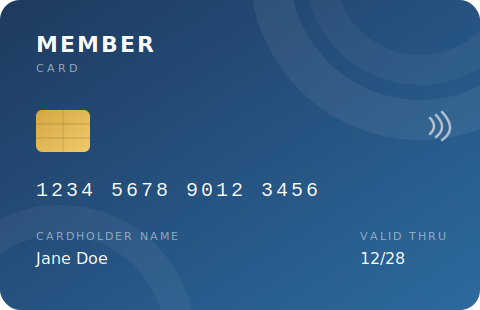
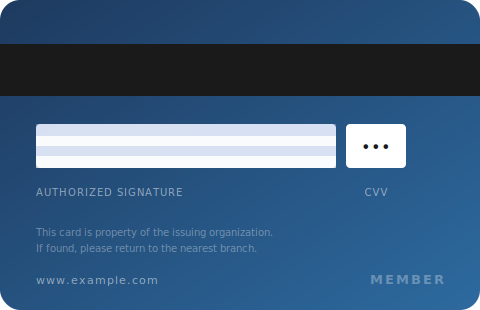

<div align="center">



# FlipCard

**A minimal, accessible 3D flip card component for Next.js.**

Click to flip — smooth CSS 3D rotation, hover tilt, no dependencies.

[](LICENSE)
[](https://nextjs.org)
[](https://tailwindcss.com)
[](https://www.typescriptlang.org)

</div>

---

## Preview

<div align="center">

| Front | Back |
|:-----:|:----:|
|  |  |

*Open `demo/index.html` in any browser to try the live interaction — no setup required.*

</div>

---

## Features

- 🔄 &nbsp;Smooth 3D flip animation on click
- 🖱️ &nbsp;Subtle hover tilt effect
- ⌨️ &nbsp;Fully keyboard accessible — `Enter` or `Space` to flip
- ♿ &nbsp;ARIA attributes for screen readers
- 📱 &nbsp;Responsive width out of the box
- ⚙️ &nbsp;Configurable aspect ratio — defaults to standard card format
- 🖼️ &nbsp;Uses Next.js `<Image>` for optimized loading

---

## Requirements

- Next.js 13+ (App Router)
- Tailwind CSS

---

## Installation

Copy `FlipCard.tsx` into your project:

```bash
cp FlipCard.tsx your-project/components/FlipCard.tsx
```

---

## Usage

```tsx
import { FlipCard } from "@/components/FlipCard";

<FlipCard
  frontImage="/images/card-front.webp"
  backImage="/images/card-back.webp"
  frontAlt="Membership card front"
  backAlt="Membership card back"
  hint="Click to flip"
/>
```

---

## Props

| Prop | Type | Default | Description |
|------|------|---------|-------------|
| `frontImage` | `string` | — | Path or URL to the front image *(required)* |
| `backImage` | `string` | — | Path or URL to the back image *(required)* |
| `frontAlt` | `string` | `"Card front"` | Alt text for the front image |
| `backAlt` | `string` | `"Card back"` | Alt text for the back image |
| `aspectRatio` | `string` | `"2042/1316"` | CSS `aspect-ratio` value |
| `hint` | `string` | `"Click to flip"` | Label below the card — set `""` to hide |

---

## Customization

Override the width by wrapping in your own container:

```tsx
<div className="w-72">
  <FlipCard frontImage="..." backImage="..." />
</div>
```

---

## Demo images

Generic demo cards are included in `demo/` as SVG files. Replace them with your own images.

---

## License

MIT © [Benjamin Flassig](https://github.com/BFlassig)
